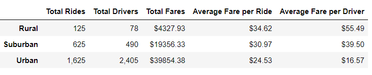

# PyBer Analysis

## Overview of the analysis:

### In this module we were asked to analyze some ride sharing data that was provided to us as part of our first assignment with PyBer, a Python based ride-sharing app company. This data provided was collected from two different CSV files, "city_data.csv" and "ride_data.csv".
### We were tasked with creating several types of visualizations in order to help PyBer improve access to ride-sharing services and determine affordability for underserved neighborhoods. 

## Results:

### The first step in this analysis was to combine and merge the data from both files. Once completed, we were able to create a new PyBer Summary data frame, pictured below. As shown in the png file, the Total Rides in Urban Cities, as well as the Total Fares, were the highest within that time frame, Total Rides was 1625, and Total Fares was $39,854. Next, Suburban cities had a total of 625 rides, and $19,356 in Total Fares. Last, the Rural cities only had 125 Total Rides and only generated $4326 in Total Fares.

### On the other hand, we notice that the Average Fare per Ride is the opposite. The Average Fare per Ride in Rural cities was around $35/ride, while in Suburban Cities that average was around $31/ride, and within the Urban Cities the average was only around $24/ride. 

### Similarly, the Average Fare per Driver was a lot higher in Rural types of cities, with an average of approximately $55 per driver. In the Suburban Cities, that average was around $40, and it drops all the way to around $16/driver in Urban Cities.

### The multiple line graph below displays the Weekly Total Fare by City Type. As shown, we clearly see that the Urban Cities have the highest Weekly Total Fares throughout the 4 months-period, followed by the Suburban Cities, and last Rural Cities, which is clearly where most of the PyBer company's income comes from.

## Summary:

* As we stated above, the goal from our study and analysis was to improve access to ride-sharing services as well as determine affordability for underserved neighborhoods. Both the image and graph above clearly show that Rural Cities are PyBer's main area of opportunity, due to the fact that Total Fares and Total Rides from these cities are around 10 times less than what it is being generated in Urban Cities.
* To help do so, the company would need to study and create ways to better market their services in Rural Cities, this will help attract more drivers, which in return will help adjust the average fares per rides, and then ultimately will encourage more people to utilize PyBer's services and increase their number of rides in the rural areas.
* A similar recommendation would also work for Urban and Suburban cities, if the company increases the number of drivers available, the competitive market will help reduce the fares even more, thus encouraging more customers/riders. The only downfall with this approach will be the drivers' reaction to the company adding more drivers to compete in their market, because while more drivers would help the company attract more riders, but it would most likely impact the drivers' income if the rates were to be decreased more, or maybe it'll force the drivers to put in more hours of work to generate the same amount from before, since the new average fare per ride would change/drop.
